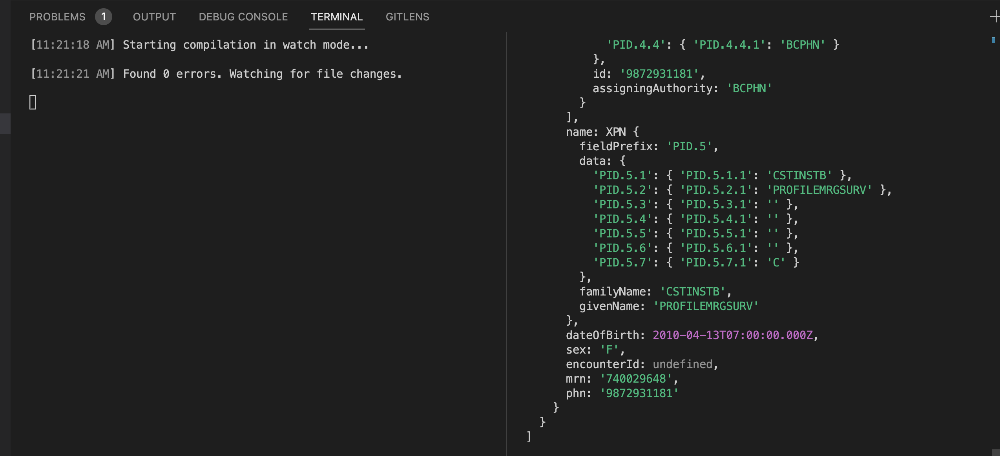
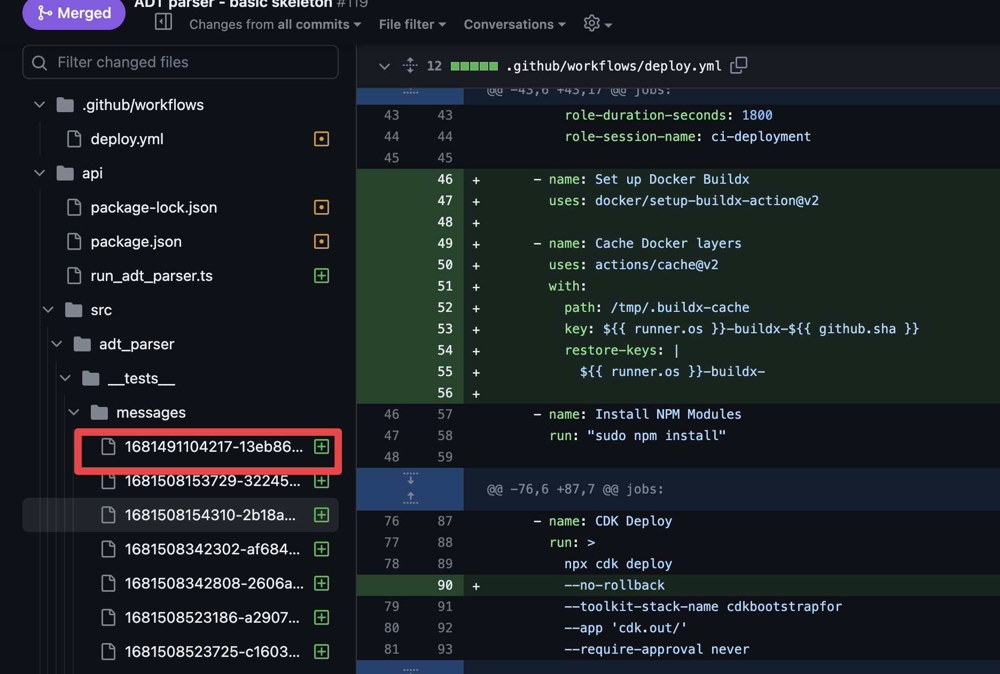
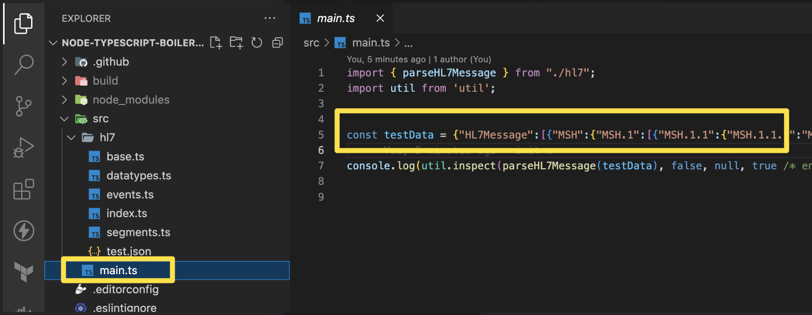

# ADT-Parser from Will

## Development

Open 2 terminal windows:

- `npm run build:watch`
- `npm run start`

## Get Test Data

- Getting test data from here:
These files are already in `feat-app-dev` branch.
The following link is the PR from Dr. Will.
https://github.com/BCHealth-ca/phsa-imits-aws-forensics-app/pull/119/files

Choose one .json file and then replace in the next step.

- replace test data from here:
